# `oneblue`

A Simple Colormap for `Matplotlib`.

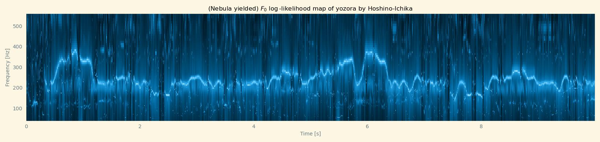

## Requirements

Ensure [NumPy](https://numpy.org/) ([`NumPy` on GitHub](https://github.com/numpy/numpy/)), and [Matplotlib](https://matplotlib.org/) ([`Matplotlib` on GitHub](https://github.com/matplotlib/matplotlib/)) is installed already before installing `oneblue`.

One of most simple ways to install them is installing it with `conda`:

```sh
$ conda install numpy matplotlib
```

## Installation

Currently the latest version of `mikutoolkit` can be installed with `pip` as following:

```sh
$ pip install oneblue --upgrade
```

or [from source](https://github.com/sandyzikun/oneblue/) like other packages.

## Importation

To access `oneblue` and its functions import it in your Python code like this:

```py
>>> from matplotlib import pyplot as plt
>>> plt.style.use("whatever_u_like_ggplot_4_instance")
>>> from oneblue import oneb1ue
>>> with plt.rc_context({ "image.cmap": oneb1ue.cmap }):
...     ...
...     ...
...     plt.show()
```

## Comparison with other Colormaps in `Matplotlib`

|     Colormap  Name     |  `Nebula`[^1]  Likelihood-map  | IM<sup>2</sup>C  2019[^2]  D-1 | SST of Yellow Sea Cold Water Mass Area at 15:00, Dec 24<sup>th</sup>, 2006 |
|------------------------|--------------------------------|--------------------------------|-|
|       `"Greys"`        | 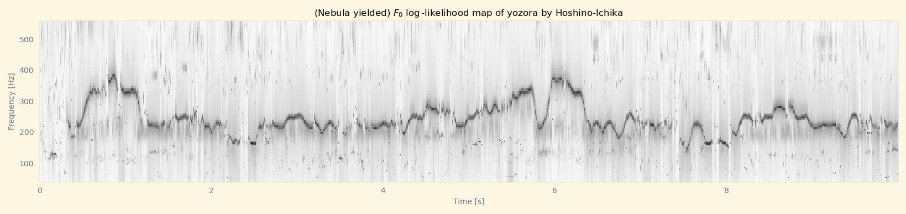 |  | 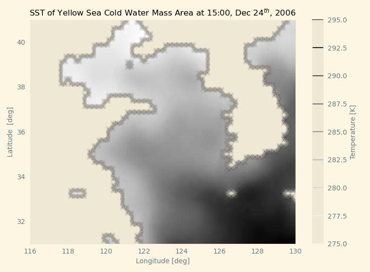 |
|      `"Greys_r"`       | 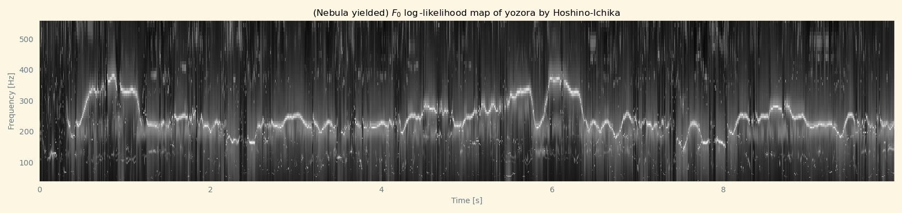 | 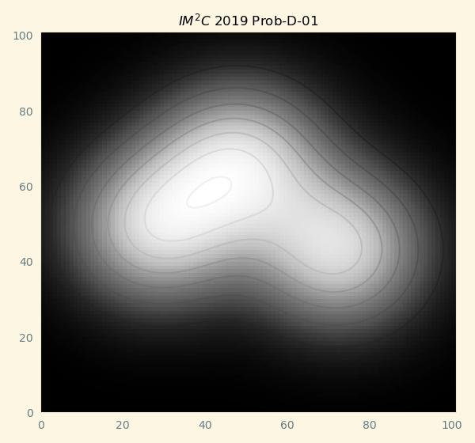 | 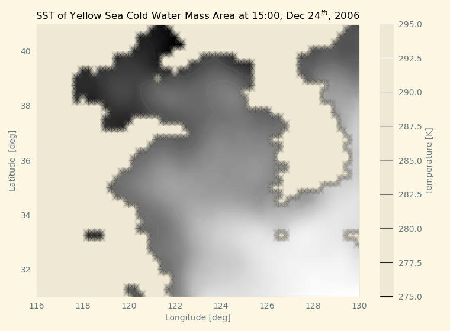 |
|      `"Seismic"`       | 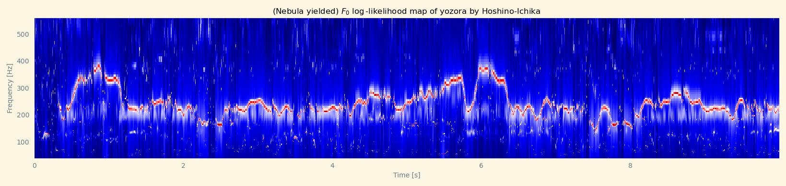 | 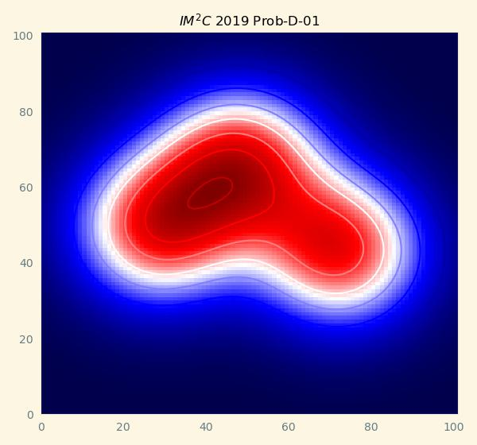 | 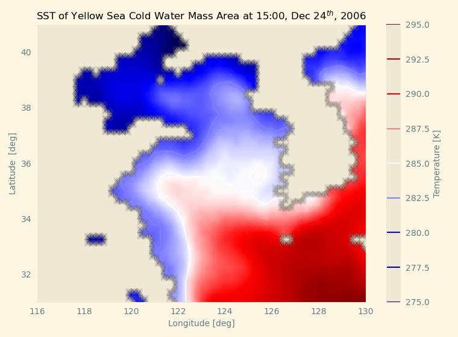 |
| `oneblue.oneb1ue.cmap` |  | 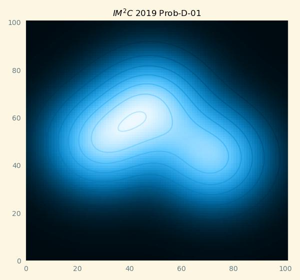 | 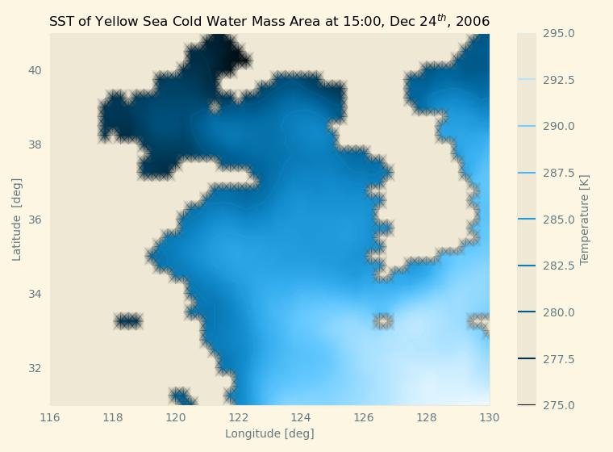 |
| `oneblue.oneb1ue.dmap` | 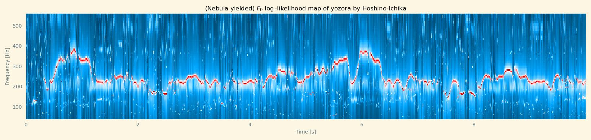 | 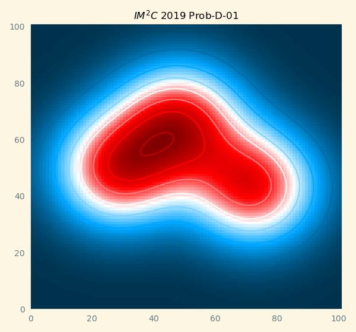 | 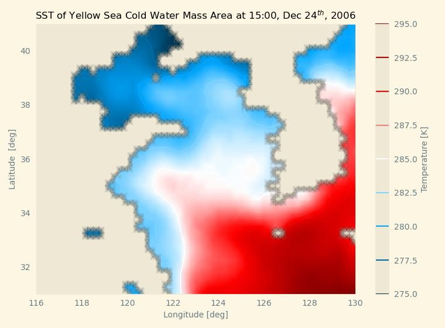 |

## References

[^1]: [`@sleepwalking/Nebula`](https://github.com/Sleepwalking/nebula/): Zero-data (yet trainable) probabilistic fundamental frequency estimator.
[^2]: [IMMC](http://istem.info/web/text.php?id=50)

## Extra

The Colormaps are inspired by the theme colors of Hoshino-Ichika and Luo-Tianyi.
